  

  <samp>
    backend developer @ <a href="https://github.com/Aesterial">Aesterial</a> 
    Go • PostgreSQL • gRPC 
    software architecture • distributed systems • API design 
    Docker • CI/CD • backend infrastructure
  </samp>

  
  
  

 

  I build backend systems with a focus on structure, reliability and growth beyond MVP.

  Currently working with services, data flows and product backends. 
  Interested in observability, platform engineering and safer architecture.

 

  

  

 

  <samp>
    current work 
    <a href="https://github.com/Aesterial/Website">Aesterial/Website</a> - backend for the City of Ideas platform 
    <a href="https://github.com/Aesterial/SecureGuard">Aesterial/SecureGuard</a> - backend for a desktop password vault
  </samp>

 

  <samp>
    contact 
    telegram: <a href="https://t.me/Ivan_kem">@Ivan_kem</a> 
    discord: Ivan_kem_twink 
    steam: <a href="https://steamcommunity.com/id/ivan_kem">ivan_kem</a>
  </samp>

